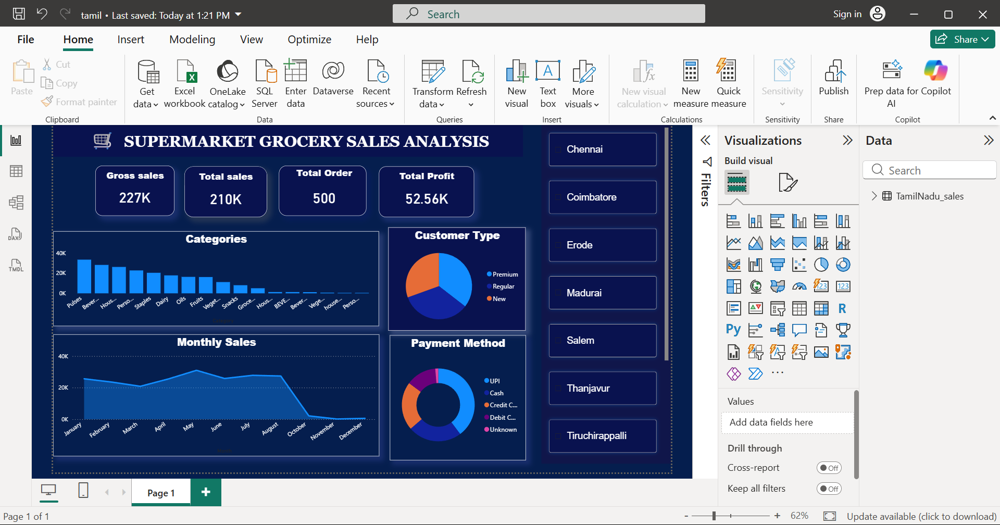
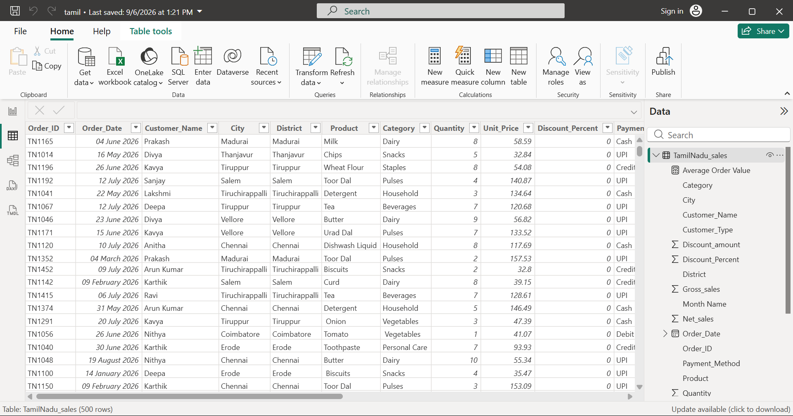

# 🛒 GroceryIQ — Smart Supermarket Sales Analytics

• GroceryIQ is an interactive **Power BI dashboard** built to explore supermarket sales data and meaningful insights across products, customers, categories, and business performance.

> **Discovering the story behind every grocery sale through data.**
---

## 💡 The Idea Behind GroceryIQ

  • Which categories contribute more to sales?
  
  • How does performance change over time?

GroceryIQ brings these answers together in one interactive dashboard, making sales data easier to explore and understand.

> Every supermarket transaction carries a small piece of the bigger business story.

---

## 🧰 Built With

📊 Power BI - Used to transform the sales data into an interactive dashboard with visual reports, KPIs, filters, and business insights.

🧮 DAX - Used to create calculated measures and support sales and performance analysis.

🧹 Data Preparation - Used to organize and prepare the raw sales data before building the dashboard.

---

## 📸 Dashboard Showcase

### Main Dashboard

### Data view

---

## 🌐 Live Demo

👉 [Explore live](tamil.pbix)

## What You Can Explore

* 📊 Monitor overall sales performance
* 💰 Analyze revenue and profit
* 🛒 Explore product and category performance
* 📅 Discover sales trends over time
* 👥 Explore customer and payment patterns
  
---

## 📚 What I Learned

Building GroceryIQ helped me strengthen my understanding of **Power BI, DAX, data preparation, dashboard design, and business-focused data analysis**.

> **Explore the data. Discover the patterns. Tell the story.** 

## 👩‍💻 Developed By

**Poornima**
